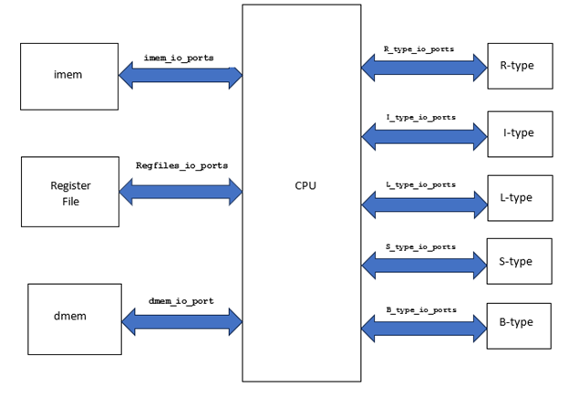

# ece571-riscv-sv-conversion
Project attempting to convert RISC-V Model from Verilog to SystemVerilog

<!-- Insert Image Here -->

<!-- LINK SUMMARY VIDEO SOMEWHERE IN THE README!! -->

## Table of Contents

- [Description](#description)
- [Design](#design)
- [Current State](#current-state-of-the-project)
- [Post Project Notes](#post-project-notes)
- [Installation](#installation) <!-- Should I have Installation and Usage above or below the Design, Current State, Changes, etc? -->
- [Usage](#usage)
- [Credits](#credits)
- [License](#license)

## Description

The goal of this project attempts to convert emil's RISC-V implementation from Verilog to SystemVerilog. This project seeks to prove our understanding of SystemVerilog for our "Intro to SystemVerilog" graduate course. RISC-V has many different variants as the ISA was deisgned to be as flexible and expandable as possible. This model is based on the RV32I variant which is one of the primary base integer variants. The "I" in the descriptor refers the variant being one of the base integer variants and the "32" refers to the user addressing size. This means our model needs to handle the most basic set of ISA instructions with 32-bit addressing. There are other variants and extension modules that could be added to the model, but that is out of scope of this project. 

More information about RISC-V can be found  and 

<!-- Output Format/Modes -->

<!-- Insert Image of Format? -->


## Designs

The model that this project is building off of is designed as a behavioral model instead of an architectural model. We decided to keep this level of abstraction and convert the model to use SV data types and SV interconnects. Other changes were also made to the design to help the team demonstrate our understanding of SystemVerilog, even if the changes were not needed functionally. Below is a block diagram of the model. 

**High Level Block Diagram**


<!-- Design Implementation Choices-->


## Current State of the Project

By the end of the project we were successful in converting the original Verilog model to SystemVerilog and maintain the functionality. 


## Post Project Notes

This project could be further expanded if desired in the future. With RISC-V being very module, different extension modules could be added to the design. Other expansions to the model include the addition pipelining and even adding more complex cache models to the system and adding integration for more complex cache and memory protocols. 


## Installation
**Repo Structre** 

The individual contributions folder contains separate folders for each member of the group.
In these folders are copies of the files that each person contributed to the project.
A notes file is also included for anyone who worked on/modified other files.

The implementation test folder contains any WIP files. 
If any changes are to be made, the changes will be made to these files. 
This ensures that a working version of the files is maintained, even when changes are being applied. 

The src and tb folders contain the current working versions of the model and testbench respectively.  
NOTE: Some individual module testbenches may no longer work as modifications were made to each module for CPU implementation. 

<!-- Specify what the primary c file is -->
<!-- Potential reorganize repo and divert the other files into an archive folder -->


<!--
## Usage

Provide instructions and examples for use. Include screenshots as needed.

To add a screenshot, create an `assets/images` folder in your repository and upload your screenshot to it. Then, using the relative filepath, add it to your README using the following syntax:

    ```md
    
    ```

## Features

If your project has a lot of features, list them here.

## Tests

-->

## Credits

<!-- List your collaborators, if any, with links to their GitHub profiles. -->
- Kai Roy
- Sri Sai Sumanth Yadalapalli 
- Shruti Koth
- Vijaya Manikanta Kotagiri 

